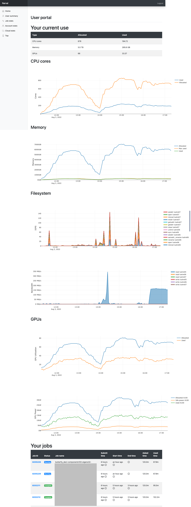
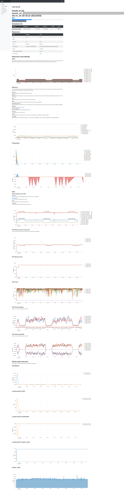
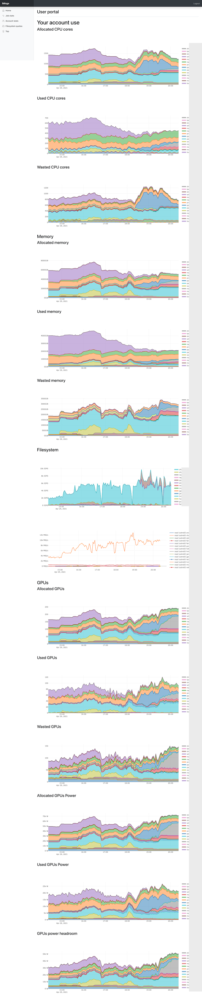
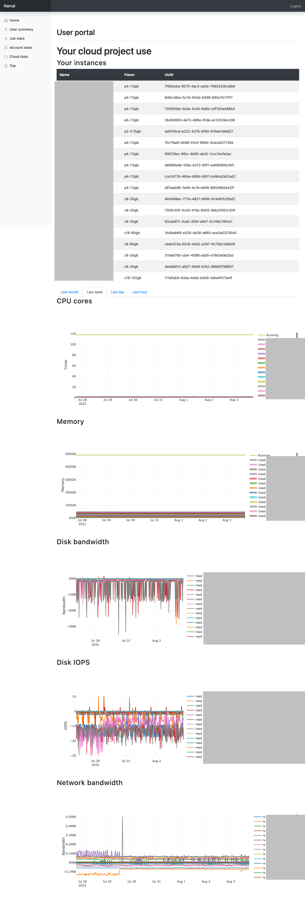
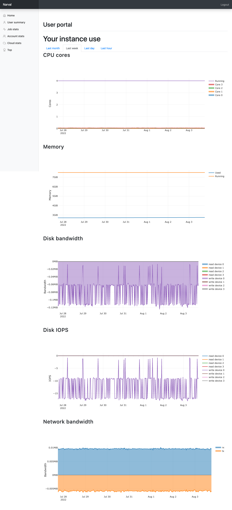
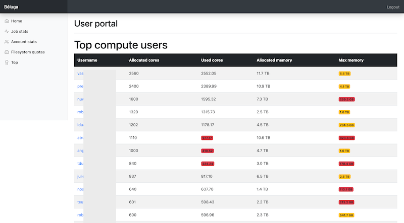
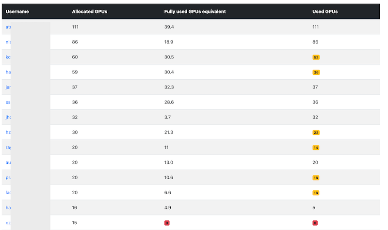
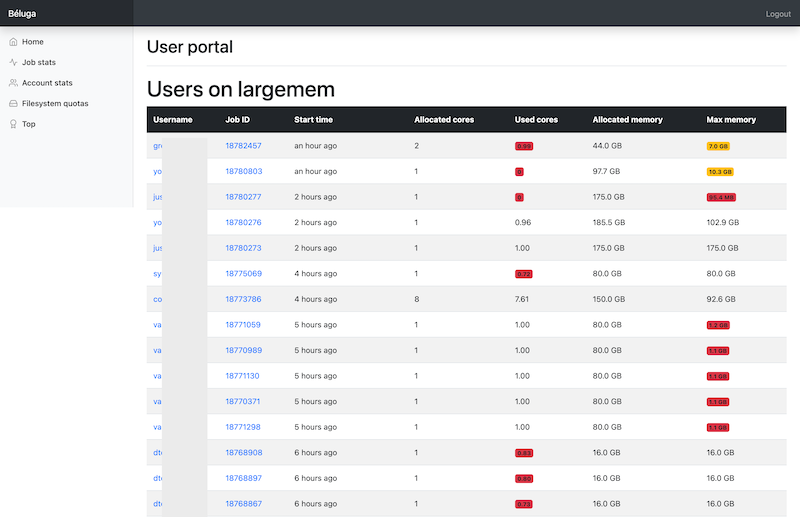
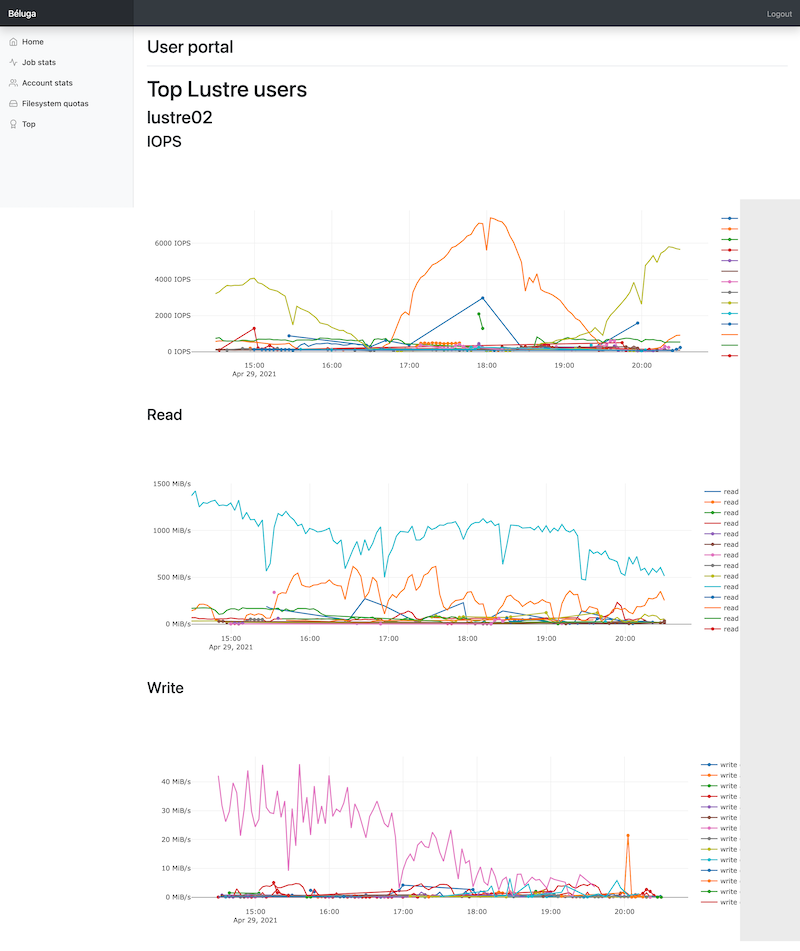
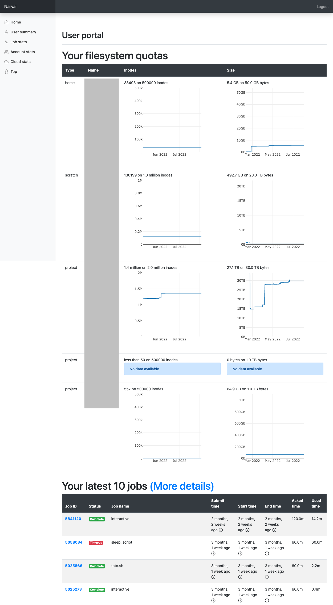

# Trailblazing Turtle
🐢🚀

This web portal is intended to give HPC users a view of the overall use of the HPC cluster and their own use.
The openstack users are able to see their own use without having to install a monitoring agent in their VM.
Staff members can also see the use of any users to help them optimize their use of HPC and openstack clusters.

The portal is composed of multiple independant modules:

* Jobstats
* Accountstats
* Cloudstats
* Quotas
* Top (only for staff)

## Design
Jobs and filesystems metrics are stored in Prometheus, multiple exporters are used to get this data, most are optional. 

The Django portal will also access various MySQL databases to gather some informations. Timeseries are stored with Prometheus for better performance. Compatible alternative to Prometheus like Thanos, VictoriaMetrics and Grafana Mimir should work without any problems (Thanos is used in production). Recorder rules in Prometheus are used to pre-aggregate some stats for the portal.


## UI modules

This portal is made to be modular, some modules can be disabled if the data required is not needed or collected. Some modules have optional dependencies, if the dependencies are not met some graphs will not be displayed.

### Jobstats
Each user can see their current uses on the cluster and a few hours in the past. The stats for each job are also available. Information about CPU, GPU, memory, filesystem, infiniband, power, etc. is also available per job.

<a href="docs/user.png"></a>
<a href="docs/job.png"></a>

#### Requirements
* Access to the database of Slurm
* slurm-job-exporter

Optional:

* node\_exporter (show node information)
* redfish\_exporter (show power information)
* lustre\_exporter and lustre\_exporter\_slurm (show Lustre information)
* jobscript collector (show the submitted jobscript)

### Accountstats
The users can also see the aggregated use of the users in the same group. This also show the current priority of this account in slurm and a few months of history on how much the account used.

<a href="docs/accountstats.png"></a>

#### Requirements

* Access to the database of Slurm
* slurm-job-exporter

Optional:

* lustre\_exporter and lustre\_exporter\_slurm (show Lustre information)
* slurm-exporter (show priority information)

### Cloudstats
The stats of VM running on Openstack can be viewed. This is using the stats of libvirtd, no agent need to be installed in the VM. There is a overall stats page available for staff. The page per project and per VM is also available for the users.

<a href="docs/cloudstats.png"></a>
<a href="docs/cloudstats_rpoject.png"></a>
<a href="docs/cloudstats_vm.png"></a>

#### Requirements

* libvirtd_exporter

### Quotas
Each user can see their current storage allocations and who within their group are using the group quota.

<a href="docs/quota.png"></a>

Info about HSM state (Tape) are also available.

<a href="docs/hsm.png"></a>

#### Requirements
* Read-only access to the databases of Robinhood

### Top
These pages are only available to staff and are meant to visualize poor cluster utilization:

* Largest compute users, CPU cores and GPUs
* Jobs on large memory nodes (ranked by worst to best)
* Top users on Lustre

<a href="docs/top_compute.png"></a>
<a href="docs/top_compute_gpu.png"></a>
<a href="docs/top_largemem.png"></a>
<a href="docs/top_lustre.png"></a>

#### Requirements
* Access to the database of Slurm
* slurm-job-exporter

Optional:

* lustre\_exporter and lustre\_exporter\_slurm (show Lustre information)

### Usersummary
The usersummary page can be used for a quick diagnostic of a user to see their current quotas and last jobs.

<a href="docs/usersummary.png"></a>

#### Requirements
* Access to the database of Slurm
* slurm-job-exporter

## Data sources
Some features will not be available if the exporter required to gather the stats is not configured.

### slurm-job-exporter
[slurm-job-exporter](https://github.com/guilbaults/slurm-job-exporter) is used to capture informations from cgroup managed by slurm on each compute nodes. This gather CPU, memory and GPU utilization.

The following recorder rules are used to pre-aggregate stats shown in the user portal.

```
---
groups:
- name: recorder.rules
  rules:
  - record: slurm_job:allocated_core:count
    expr: count(slurm_job_core_usage_total) by (cluster)
  - record: slurm_job:allocated_core:count_user_account
    expr: count(slurm_job_core_usage_total) by (user,account,cluster)
  - record: slurm_job:used_core:sum
    expr: sum(rate(slurm_job_core_usage_total{}[2m]) / 1000000000) by (cluster)
  - record: slurm_job:used_core:sum_user_account
    expr: sum(rate(slurm_job_core_usage_total{}[2m]) / 1000000000) by (user,account, cluster)
  - record: slurm_job:allocated_memory:sum
    expr: sum(slurm_job_memory_limit{}) by (cluster)
  - record: slurm_job:allocated_memory:sum_user_account
    expr: sum(slurm_job_memory_limit{}) by (user,account,cluster)
  - record: slurm_job:rss_memory:sum
    expr: sum(slurm_job_memory_rss) by (cluster)
  - record: slurm_job:rss_memory:sum_user_account
    expr: sum(slurm_job_memory_rss) by (user, account, cluster)
  - record: slurm_job:max_memory:sum_user_account
    expr: sum(slurm_job_memory_max) by (user, account, cluster)
  - record: slurm_job:allocated_gpu:count
    expr: count(slurm_job_utilization_gpu) by (cluster)
  - record: slurm_job:allocated_gpu:count_user_account
    expr: count(slurm_job_utilization_gpu) by (user, account, cluster)
  - record: slurm_job:used_gpu:sum
    expr: sum(slurm_job_utilization_gpu) by (cluster)/ 100
  - record: slurm_job:used_gpu:sum_user_account
    expr: sum(slurm_job_utilization_gpu) by (user,account,cluster) / 100
  - record: slurm_job:non_idle_gpu:sum_user_account
    expr: count(slurm_job_utilization_gpu > 0) by (user,account,cluster)
  - record: slurm_job:power_gpu:sum
    expr: sum(slurm_job_power_gpu) by (cluster)
  - record: slurm_job:power_gpu:sum_user_account
    expr: sum(slurm_job_power_gpu) by (user,account,cluster)
```

### slurm-exporter
[slurm-exporter](https://github.com/guilbaults/prometheus-slurm-exporter/tree/osc) is used to capture informations from slurm like the priority of each users. This portal is using a fork, branch `osc` in the linked repository. This fork support GPU reporting and sshare stats.

### Access to the database of slurmacct
This mysql database is accessed with a read only user. It does not need to be in the same database server where django is storing its data.

### lustre\_exporter and lustre\_exporter\_slurm
Those 2 exporters are used to gather information about Lustre usage.

* [lustre\_exporter](https://github.com/HewlettPackard/lustre_exporter) capture information on Lustre MDS and OSS but will only use \$SLURM\_JOBID as a tag on the metrics.
* [lustre\_exporter\_slurm](https://github.com/guilbaults/lustre_exporter_slurm) is used as a proxy between Prometheus and lustre_exporter to improve the content of the tags. This will match the \$SLURM\_JOBID to a job in slurm and will add the username and slurm account in the tags.

The following recorder rules are used to pre-aggregate stats shown in the user portal.

```
---
groups:
- name: recorder.rules
  rules:
  - record: lustre:read_bytes:rate3m
    expr: sum(label_replace(rate(lustre_read_bytes_total{component="ost"}[3m]), "fs", "$1", "target", "(.*)-OST.*")) by (fs, cluster)
  - record: lustre:write_bytes:rate3m
    expr: sum(label_replace(rate(lustre_write_bytes_total{component="ost"}[3m]), "fs", "$1", "target", "(.*)-OST.*")) by (fs, cluster)
  - record: lustre:read_bytes:rate3m_user
    expr: sum by (user,fs,cluster,account) (rate(lustre_job_read_bytes_total{}[3m]))
  - record: lustre:write_bytes:rate3m_user
    expr: sum by (user,fs,cluster,account) (rate(lustre_job_write_bytes_total{}[3m]))
  - record: lustre:metadata:rate3m
    expr: sum(label_replace(rate(lustre_stats_total{component="mdt"}[3m]), "fs", "$1", "target", "(.*)-MDT.*")) by (fs,operation,cluster)
  - record: lustre:metadata:rate3m_user
    expr: sum by (user,fs,cluster,account) (rate(lustre_job_stats_total{}[3m]))
```

### redfish\_exporter
[redfish\_exporter](https://github.com/jenningsloy318/redfish_exporter) is used to gather the power usage of the nodes. This information is used to compute the energy used by a job and related metrics like CO2 emmissions.

### node\_exporter
[node\_exporter](https://github.com/prometheus/node_exporter) is used to gather generic information about the nodes. This is the default exporter used by most Prometheus installations. That information is used to show metrics like local disk IO of the nodes within the job.

### libvirtd\_exporter
[libvirtd\_exporter](https://github.com/guilbaults/libvirtd_exporter/tree/metadata) is used to gather information about the VM running on Openstack.

### Database used by Robinhood
The information in this database is used to show the current utilization per user within a group.

### jobscript collector
The REST API provided by Django is used by a small deamon running on every compute node. This deamon will upload the job script when a job is starting on the node. The content of this script is made available in the jobstats module.

## Test environment
There is a minimal config example in the example directory. This example only enable the `jobstats` and `top` module. Those modules only require the `slurm-job-exporter` exporter and a connection to the slurm database.

Copy the 2 following files and edit them to your needs.
The first file is the config file for the django application, databases connections, the name of the enabled exporters and other settings are defined here.

The second file need to be modified so site specific information like where the allocations are stored can be used. The functions provided are meant to be examples, you can use them or create your own. Our production functions are located in `userportal/common.py`, some leftover are included in the comments of the `example/common.py` file. The functions to modify are indicated in the file with the comment `# IMPLEMENTATION`.

```
cp example/settings.py.dist example/settings.py
cp example/common.py userportal/common.py
```

Then you can launch the example server:
```
REMOTE_USER=myuser@computecanada.ca affiliation=staff@computecanada.ca python manage.py runserver --settings example.settings
```

This will start the server on port 8000 and remove the requirement to authenticate using the SSO. You should test with your own username instead of "myuser" so the access to slurm can find some of your previous jobs. For the initial test, you can keep the `affiliation=staff@computecanada.ca`, this is how our production server is mapping staff and non-staff users.

## Production

RPMs required for production

* `shibboleth`
* `python36-virtualenv` 
* `python3-mod_wsgi`
* `openldap-devel`
* `gcc`
* `mariadb-devel`
* `xmlsec1`
* `xmlsec1-openssl`

A file in the python env need to be patched, check the diff in `ldapdb.patch`

Static files are handled by Apache and need to be collected since python will not serve them:

```
python manage.py collectstatic
```

## SAML2

```
openssl req -nodes -new -x509 -newkey rsa:2048 -days 3650 -keyout private.key -out public.cert
```

Download the metadata file from the IDP as metadata.xml
Our shibboleth only seems to work with Redirect binding, so we remove manually the POST binding for SingleSignOnService.

## API
An API is available to modify resources in the database. This is used by the jobscript collector. A local superuser need to be created:

```
python manage.py createsuperuser
```

The token can be created with:

```
manage.py drf_create_token
```

## Slurm prolog script
The script `slurm_prolog/slurm_prolog_userportal.py` can be used to add the submited script to the database of the portal. This should run as a slurm prolog script. This script use the API to push to job script and will need a user/token.

## Upgrades
When SQL models are modified, the automated migration script need to run once:
```
python manage.py migrate
```

### Apache virtualhost config

```
<VirtualHost *:443>
  ServerName userportal.int.ets1.calculquebec.ca

  ## Vhost docroot
  DocumentRoot "/var/www/userportal"
  ## Alias declarations for resources outside the DocumentRoot
  Alias /static "/var/www/userportal-static"
  Alias /favicon.ico "/var/www/userportal-static/favicon.ico"

  ## Directories, there should at least be a declaration for /var/www/userportal

  <Directory "/var/www/userportal/">
    AllowOverride None
    Require all granted
  </Directory>

  <Directory "/var/www/userportal/static">
    AllowOverride None
    Require all granted
  </Directory>

  <Location "/secure">
    Require shib-session
    AuthType shibboleth
    ShibRequestSetting requireSession 1
  </Location>

  <Location "/Shibboleth.sso">
    Require all granted
    SetHandler shib
  </Location>

  ## Logging
  ErrorLog "/var/log/httpd/userportal.int.ets1.calculquebec.ca_error_ssl.log"
  ServerSignature Off
  CustomLog "/var/log/httpd/userportal.int.ets1.calculquebec.ca_access_ssl.log" combined

  ## SSL directives
  SSLEngine on
  SSLCertificateFile      "/etc/pki/tls/certs/userportal.int.ets1.calculquebec.ca.crt"
  SSLCertificateKeyFile   "/etc/pki/tls/private/userportal.int.ets1.calculquebec.ca.key"
  WSGIApplicationGroup %{GLOBAL}
  WSGIDaemonProcess userportal python-home=/var/www/userportal-env python-path=/var/www/userportal/
  WSGIProcessGroup userportal
  WSGIScriptAlias / "/var/www/userportal/userportal/wsgi.py"
  ## Shibboleth
</VirtualHost>
```

## Translation
Create the .po files for french: `python manage.py makemessages -l fr`

Update all message files for all languages:
```
python manage.py makemessages -a
python manage.py makemessages -a -d djangojs
```

Compile messages: `python manage.py compilemessages`

