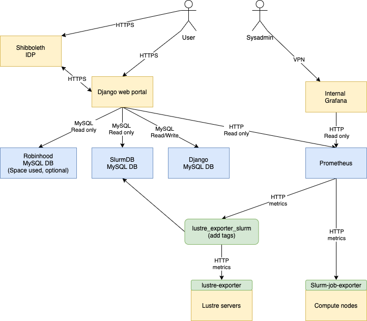

# Trailblazing Turtle
🐢🚀

[](https://zenodo.org/badge/latestdoi/549763009)

This web portal is intended to give HPC users a view of the overall use of the HPC cluster and their use. This portal is using the information collected on compute nodes and management servers to produce the information in the various modules:

* [jobstats](docs/jobstats.md)
* [accountstats](docs/accountstats.md)
* [cloudstats](docs/cloudstats.md)
* [quotas](docs/quotas.md)
* [top](docs/top.md)
* [usersummary](docs/usersummary.md)

Some examples of the available graphs are displayed in the documentation of each module. 

This portal is made to be modular, some modules can be disabled if the data required is not needed or collected. Some modules have optional dependencies, if the dependencies are not met some graphs will not be displayed.

This portal also supports Openstack, the users can see their use without having to install a monitoring agent in their VM in their OpenStack VMs.

Staff members can also see the use of any users to help them optimize their use of HPC and OpenStack clusters.

Some information collected is also available for the general public like the number of cores used, the performance of the filesystem, and the load on the login nodes.
[Here is an example of this portal for the Narval Cluster at Calcul Quebec](https://portail.narval.calculquebec.ca/)

## Design
Performance metrics are stored in Prometheus, multiple exporters are used to gather this data, and most are optional.

The Django portal will also access various MySQL databases like the database of Slurm and Robinhood (if installed) to gather some information. Timeseries are stored with Prometheus for better performance. Compatible alternatives to Prometheus like Thanos, VictoriaMetrics, and Grafana Mimir should work without any problems (Thanos is used in production). Recorder rules in Prometheus are used to pre-aggregate some stats for the portal.



## Data sources
Various data sources are used to populate the content of this portal. Most of them are optional and their usefulness depends on the modules enabled.

[Data sources documentation](docs/data.md)

## Test environment
A test environment using the local `uid` resolver and dummies allocations is provided to test the portal.

To use it, copy `example/local.py` to `userportal/local.py`. The other functions are documented in `common.py` if any other overrides are needed for your environment.

To quickly test and bypass authentication, add this line to `userportal/settings/99-local.py`. Other local configuration can be added in this file to override the default settings.

```
AUTHENTICATION_BACKENDS.insert(0, 'userportal.authentication.staffRemoteUserBackend')
```

This bypasses the authentication and will use the `REMOTE_USER` header or env variable to authenticate the user. This is useful to be able to try the portal without having to set up a full IDP environment. The REMOTE_USER method can be used when using shibboleth or other IDP. SAML2 is now the preferred authentication method for production.

Examine the default configuration in `userportal/settings/` and override any settings in `99-local.py` as needed.

Then you can launch the example server with:

```
REMOTE_USER=someuser@alliancecan.ca affiliation=staff@alliancecan.ca python manage.py runserver
```

This will run the portal with the user `someuser` logged in as a staff member.

Automated Django tests are also available, they can be run with:

```
python manage.py test
```

This will test the various modules, including reading job data from the Slurm database and Prometheus. A temporary database for Django is created automatically for the tests. Slurm and Prometheus data are read directly from production data with a read-only account. A representative user, job and account need to be defined to be used in the tests, check the `90-tests.py` file for an example.

## Production install
The portal can be installed directly on a Centos7 or Rocky8 Apache web server or with Nginx and Gunicorn. The portal can also be deployed as a container. The various recommendation for any normal Django production deployment can be followed.

[Deploying Django](https://docs.djangoproject.com/en/3.2/howto/deployment/)

[Install documentation](docs/install.md)