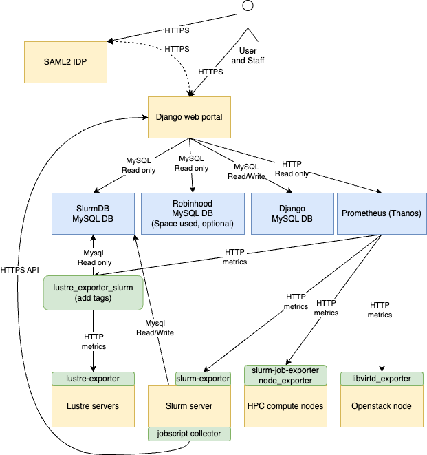

# TrailblazingTurtle

# Introduction
TrailblazingTurtle is a web portal for HPC clusters. It is designed to be a single point of entry for users to access information about the cluster, their jobs, and the performance of the cluster. It is designed to be modular, so that it can be easily extended to support new features.

# Design
The Django portal will access various MySQL databases like the database of Slurm and Robinhood (if installed) to gather some information. 

Time series are stored with Prometheus for better performance. Compatible alternatives to Prometheus like Thanos, VictoriaMetrics, and Grafana Mimir should work without any problems (Thanos is used in production). Recorder rules in Prometheus are used to pre-aggregate some stats for the portal.

