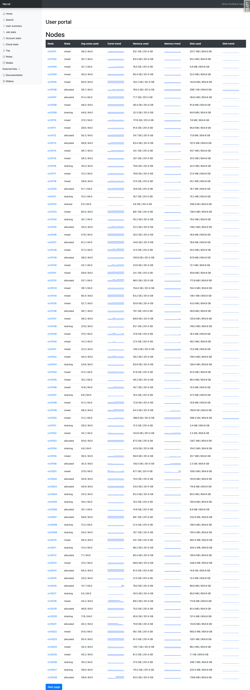

# Nodes
This main page present the list of nodes in the cluster with a small graph representing the cores, memory and localdisk used. Each node has a link to a detailed page with more information about the node similar to the jobstats page.

## Requirements
* Access to the database of Slurm
* slurm-job-exporter
* node\_exporter
